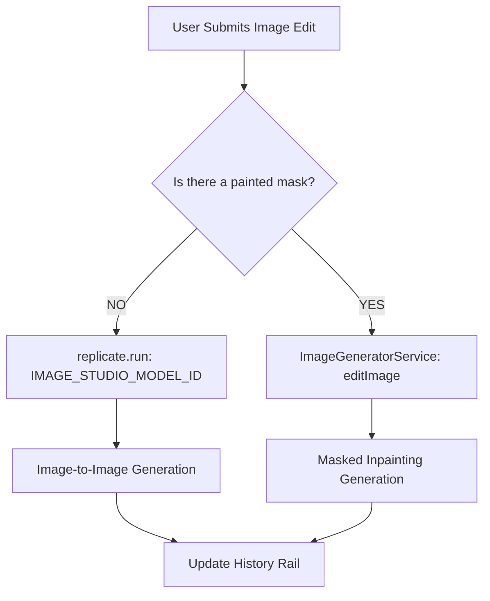

# Canvas & Image Studio

Welcome to the comprehensive, premium guide for Vurvey's **Canvas** and **Image Studio** surfaces. This document provides an exhaustive reference of all interactive features, toolbars, modal controls, and backend pipelines—including features behind feature flags like the Google Veo 3.1 video generator.

* **The Canvas:** Vurvey's central chat workspace — the same surface described on the [Home](/guide/home) page where you work with Agents, attach Sources, run web Tools, generate images, and explore agentic AI flows in a conversation.
* **Image Studio:** A dedicated, full-featured graphics and video workstation specifically optimized for precision image editing, masking, upscaling, enhancement, and AI-powered video conversion. You can open it inline from any generated image inside chat, or hit the standalone route `/{workspaceId}/image-studio` to drop into the full editor on its own. Under the hood it's powered by Google Veo 3.1 (for image → video) plus the workspace's configured image models.

---

## Overview

Vurvey separates creative and conversational workflows into two major collaborative spaces:
1. **The Canvas:** An interactive, conversational chat workspace where users collaborate with AI Agents, apply Research Tools, attach Grounding Sources, and generate high-fidelity media.
2. **Image Studio:** A dedicated, standalone or context-driven workspace specifically optimized for precision image editing, masking, upscaling, enhancement, and AI-powered video conversion.

---

## 1. The Interactive Canvas

The Canvas is the heart of Vurvey's collaborative experience. It acts as a unified command center, bringing together personas, datasets, campaigns, and external web APIs.


### Access Controls, Gating & Redirection Rules

Access to the Canvas is strictly governed by workspace-level feature flags and roles:
* **The Redirection Rule (`workspace.chatbotEnabled`):** The `workspace.chatbotEnabled` setting must be toggled **ON** in your workspace settings for the Canvas/Home chat to load. If it is toggled **OFF**, any attempt to access the Canvas route will automatically redirect the user to the **Campaigns** gallery page.
* **Guest Access Mode:** When guest users access the Canvas, the application searches for published agent personas. If no published personas are active for the workspace, the page displays a fallback message:
  ```text
  No Brand Companions are currently available.
  ```

### Chat Composer Interactions
* **The Composer Input:** Standard text area optimized for prompts. Supports auto-expanding heights up to five lines before introducing a scrollbar.
* **Slash Command Helper:** Typing `/` in the composer input immediately opens an interactive popup showing shortcuts for attached tools and image generator triggers.
* **Response Actions:** Every assistant reply features an inline **More** dropdown offering:
  * **Delete message:** Triggers a modal: *"Are you sure you want to delete this message? This action cannot be undone."*
  * **Rename conversation:** Modifies the current session title.
  * **Export history:** Generates a downloadable `.json` file of the conversation's prompt-and-response payload.

---

## 2. Comprehensive Chat Toolbar

Positioned directly above the chat composer, the toolbar is a mix of labeled chips and icon-only selectors. Below is the definitive list of active toolbar components, their control types, visibility rules, and dropdown/modal interactions.

| Component | Control Type | When Visible / Feature Flag | Dropdown / Modal Interactions & Behavior |
| :--- | :--- | :--- | :--- |
| **Agents** | Labeled Chip | Always Visible | Opens the published-agent selector. Includes filter chips (Categories, Personas), search, and explicit **Select Persona** confirmation. |
| **Populations** | Labeled Chip | `populationsEnabled` | Opens the segment chooser with search filters, population card drill-down, and a **Choose Population** action. |
| **Sources** | Icon Dropdown | Always Visible | Tooltip reads: *Select Datasets and/or Campaigns*. Triggers the grounding sources panel. |
| **Images** | Icon Dropdown | Always Visible | Dropdown listing specific image generation engines and an active toggle to enable/disable image generation. |
| **Tools** | Icon Dropdown | Always Visible | Dropdown of social and web scraping tools for search-grounded queries. |
| **Model Selector** | Icon Dropdown | `modelSelectorEnabled` | Allows selection of the underlying Large Language Model (e.g. Gemini 1.5 Pro, Gemini 1.5 Flash). |

---

### The Sources Selection Modal

Grounding your conversation is vital for generating highly accurate, non-hallucinated answers. The **Sources** dropdown provides several immediate quick actions:
* **Attach Datasets:** Immediately mounts selected document folders (opens the full Sources modal on the Datasets tab).
* **Attach Campaigns:** Mounts past research survey results (opens the full Sources modal on the Campaigns tab).
* **Turn On/Off Sources:** A fast toggle to suspend or resume grounding context.

Clicking **Manage Sources** opens the full-screen modal dashboard:


Within the modal, three primary tabs divide your content:
1. **Campaigns:** Lists all active and closed workspace surveys. Drilling into a campaign allows you to select specific questions, extracting only the relevant respondent quotes rather than the entire campaign dataset.
2. **Datasets:** Displays structured training sets.
3. **All Files:** A flat view of all individual media assets (PDFs, text files, audios, and videos) uploaded to the workspace.

> [!NOTE]
> Conversations carry a unified grounding state. This means a single chat thread can simultaneously parse survey responses, textual PDFs, and audio recordings, even if you configure them across different sub-modal tabs.

---

### Active Image Generation Engines

The **Images** dropdown allows you to choose which engine processes image generation prompts triggered in the chat:
* **Nano Banana:** Internal (small, fast image generation model perfect for quick concepts and rapid prototyping).
* **OpenAI:** DALL-E family (optimized for high-fidelity illustrations, detailed design prompts, and modern cartoon elements).
* **Google Imagen:** Google's image generator (best for high-fidelity photorealistic scenes, text rendering, and professional product staging).
* **Stable Diffusion:** Open-source SD family (recommended for diverse artistic styles, line art, and flexible aspect ratios).

*The bottom option of the dropdown is a **Turn on / Turn off image generation** toggle. With image generation off, the model picker has no effect — the Agent answers in text only.*

---

### Research Tools Selection

The **Tools** dropdown includes live scrapers and lookup widgets that the assistant can invoke mid-conversation to fetch external public information:
* **Web Research (Google Search):** Real-time web browsing to ground responses in recent events.
* **TikTok / Instagram / YouTube:** Scrapes video metrics, captions, and trending hashtags for video-centric analysis.
* **Reddit / LinkedIn / X (Twitter):** Inspects user threads, discussions, and professional network updates.

> [!WARNING]
> Prior documentation referenced Google Trends, Google Maps, and Amazon search connectors. These are deprecated and are **not** present in current versions of Vurvey's main application.

---

## 3. The Image Studio Editor

Image Studio is Vurvey's specialized graphics workstation, available as a modal popup from any chat-generated image card or as a standalone route (`/image-studio`).


### How to Access It

Image Studio offers two primary entry points:
* **Standalone Route (`/{workspaceId}/image-studio`):** Direct URL access. It is lazy-loaded via React `lazy()` from `app.tsx` so the editor bundle isn't shipped to users who never open it. Can be loaded with a query param carrying an image URL.
* **In-Context Flow:** A button on the image hover/menu opens it inline. The Studio's state is wired to the parent chat context so changes can save back.

Both entry points use the same component wrapped in `ImageHistoryContextProvider` (mounted at app-level in `app.tsx`), so the history rail tracks edits across the entire session.

### Workspace Layout

The interface is structured into three highly focused panels:
* **Left-Side History Rail:** Keeps an active timeline of all changes, generations, and upscale iterations. Users can click any thumbnail to revert or switch back and forth.
* **Main Canvas Editor:** The central editing panel housing the image and masking canvas.
* **Top Navigation Bar:** Includes persistent controls:
  * **Exit Image Studio:** Closes the editor and returns to the parent surface (chat or empty editor). Disabled while an AI update is in flight. Warns user if there are unsaved edits: *"You have unsaved changes. Are you sure you want to exit?"*
  * **Reset to Original:** Discards all mask and prompt history, returning to the source file. Visible only when (a) `originalSrc` exists, (b) the current entry isn't already the original, AND (c) the original is still in history. **Keyboard shortcut: `Alt+R`**. Disabled while updating.
  * **Download:** Downloads the current frame as a high-resolution PNG file via an anchor-element click. Opens in a new tab as fallback.
  * **Save / Apply:** (Visible when opened in-context) Saves the changes back to the active chat session or dataset card. Calls `saveImage` from `AiActionsContext` to commit the edit back to the parent. Disabled while updating or when the current entry equals the original (nothing changed).

---

### Underlying Technical Contexts

The Image Studio editor is composed around five core React contexts:
* `ImageHistoryContext`: Carries `clearImage`, `history[]`, current `imageSrc`, `originalSrc`, `setImageSrc`.
* `AiActionsContext`: Carries `isUpdatingImage`, `saveImage`, action handlers.
* `ImageElementContext`: The DOM `` `element` ref used for download/snapshot.
* `CanvasContext`: Drawing `lines`, `getMask` (mask extraction), Konva `stageRef`, `setLines`.
* `EditorSettingsContext`: `brushMode` (draw/erase), `setBrushMode`, `brushSize`, `setBrushSize`.

---

### Precision Brush Tools & Selection

The core of masked image editing lies in the brush toolbar at the bottom of the editor canvas:
* **Select (Brush Mode: `draw`, ➕ Pencil):** Paints a semi-transparent colored mask over areas you want to modify, replace, or add elements to. Uses `PencilPlusIcon`.
* **Un-select (Brush Mode: `erase`, ➖ Pencil):** Acts as an eraser, subtracting from your painted mask. Uses `PencilMinusIcon`. Uses a `destination-out` composite operation to clear mask pixels.
* **Brush Size Picker:** Opens an interactive popover with a slider to adjust brush diameters from **16px** (for fine detail masking) to **160px** (for quick background selection) with a **1px** step size. Tooltip: *"Adjust the size of your brush"*.
* **Reset Selection:** Fully clears the current mask canvas.

---

### Image Editing Actions

The action bar houses quick one-click AI operations alongside prompt-based modifications. Tooltip and placeholder text adapt to the active mode:

| Action | Tooltip Text | Placeholder when Active | Behavior / Details |
| :--- | :--- | :--- | :--- |
| **Select** | *"Select 'Select' to paint areas where you want to add something new"* | *"Describe what you want to add in the selected area (e.g. 'a red balloon', 'a small dog')"* | Left brush selector |
| **Un-select** | *"Select 'Un-select' to remove parts of your selection"* | *"Describe what should replace the selected area (e.g. 'clear blue sky', 'green grass')"* | Right eraser brush |
| **Enhance** | *"Enhance the image with creative AI (adds details, improves textures)"* | *"Enhancing image with creative AI - no prompt needed"* | Uses Recraft AI to analyze your image, upscale local textures, and correct lighting. No prompt required. |
| **Upscale** | *"Upscale the image resolution with crisp quality"* | *"Upscaling image resolution - no prompt needed"* | Performs high-density super-resolution scaling, producing a crisp, clean HD image. |
| **Remove** | *"Remove the selected area from the image"* | *"No prompt needed - just click Remove to erase the selected area"* | Completely erases the selected mask area and seamlessly blends the background (automatically passes empty string prompt to inpainting). |

---

### What Image Studio Does NOT Do

To prevent workflow confusion, keep these structural limitations in mind:
* **No vector editing:** It is strictly a raster-image editor with mask-based prompt operations.
* **No layers:** Each generation creates a new history entry; there is no Photoshop-style layer stack.
* **No simultaneous undo/redo:** Versioning is controlled exclusively via the history rail (click-to-revert).
* **No multi-image montages:** It edits one working image at a time.
* **No persistent storage:** Image history does not persist beyond the current session unless you explicitly **Save** or **Download**.

---

## 4. Convert to Video (Google Veo 3.1)

If the workspace feature flag `videoConversionEnabled` is turned **ON**, a dedicated **Convert to Video** button appears in the toolbar. Clicking this action opens the Veo 3.1 configuration panel below the canvas:


### Video Generation Controls

The panel provides detailed configuration parameters to guide the Veo 3.1 motion model:

| Control | Default | Range / Options | Description |
| :--- | :--- | :--- | :--- |
| **Video Prompt** | (empty) | Free-text prompt | A descriptive text box defining the camera movement or physics of the scene. *Example: "A slow, cinematic camera pan to the right, showing soft cinematic lighting."* |
| **Duration** | **8 seconds** | **4**, **6**, or **8** seconds | Dropdown selector with specific preset video lengths. |
| **Aspect Ratio** | **Landscape (16:9)** | **Landscape (16:9)** or **Portrait (9:16)** | Configures the video output dimensions via the `VideoAspectRatio` enum. |
| **Sample Count** | **1 video** | **1–4** videos | A granular slider to request multiple video alternatives in a single run. |
| **Person Generation** | *Allow Adults* | **Allow Adults** or **No People/Faces** | Protects safety standards and content requirements. *No People/Faces* blocks any human generation. |
| **Negative Prompt** | (empty) | Free-text (optional) | Define elements you want the motion model to completely avoid (e.g. *"jittery movement, fast transitions"*). |
| **Seed** | (undefined) | `0` to `4294967295` | Input a manual integer to ensure deterministic, reproducible motion outputs. |
| **Enhance Prompt** | **On** | Toggle checkbox | When enabled, your video prompt is pre-processed and optimized using **Gemini Flash** to enrich detail and cinematic vocabulary. |

On generation, the request goes to Veo via the backend service. Generated videos appear in the **history rail** alongside image entries — switch between them with the same selector.

> [!TIP]
> **Sample count is a generation multiplier:** Setting Sample count to 4 generates four distinct videos from the same prompt with different sampling — useful for picking the best take. Each counts as a separate generation.

---

## 5. Behind the Hood: Technical Architecture

Understanding the underlying communication between Vurvey's web client and the `vurvey-api` backend is essential for optimizing prompt performance.



### Prompt-Based Image Editing Logic

When you write an edit instruction and click send, the backend checks for mask data:
1. **No Mask Detected (Image-to-Image):** The API routes the request to Replicate using the `IMAGE_STUDIO_MODEL_ID` model. It passes the complete image as a reference (`baseImage`) along with your prompt to recreate the entire image matching the desired description.
2. **Mask Detected (Inpainting):** If a mask is painted, the system runs `ImageGeneratorService.editImage()`. The mask acts as a transparency gate: the unmasked regions remain 100% frozen, while the masked region is cleared and replaced using your prompt.

---

## Best Practices

* **Pick the right model for the job:** Nano Banana is fastest, OpenAI is best for cohesive scenes, Imagen excels at photorealism, Stable Diffusion is most controllable with prompt engineering.
* **Use the tool-aware placeholders as a guide:** They're written to nudge you to the right prompt style for each action — *"a red balloon"* for Select-add is different from *"clear blue sky"* for Un-select-replace.
* **Mask precisely:** Spend an extra 10 seconds with the brush; the AI follows your mask boundaries closely.
* **For Perfect Inpainting:** When using prompt-based edits, paint slightly wider than the subject you want to add or change. This gives the model enough pixels to naturally blend shadows and lighting.
* **Enhance and Upscale don't need prompts:** Saves keystrokes; the placeholder will tell you.
* **For video, start with a low sample count:** Generate 1, see if the style works, then run a 4-sample batch when you're happy with the direction.
* **Deterministic Motion:** If you find a camera motion you love using **Convert to Video**, copy the generation's **Seed** from the history rail and lock it into the configuration panel for your next run (same seed + adjusted prompt is your friend).
* **Use Negative Prompt to suppress common artifacts:** Use *"distorted faces, extra limbs, blurry"* as a starter.
* **Download a working version before Convert to Video:** If you're attached to the current image, download it first — video conversion creates a separate history entry and the image stays editable.
* **Grounding Efficiency:** When working on the Canvas, do not attach every workspace campaign. Attach only the specific campaign related to your query, and drill down to select the exact questions if possible. This prevents token bloat and produces highly concise citations.
* **Tools are stronger together:** Combine Sources (workspace data) with Web Research (external context) for the richest grounded answers.
* **Use `/` in chat for quick tool toggling:** Faster than the toolbar.

---

## Constraints & Limitations

* **Chat is gated by `workspace.chatbotEnabled`:** Without it, Canvas redirects to Campaigns.
* **Image Studio route is workspace-scoped** (`/{workspaceId}/image-studio`).
* **Image Studio is lazy-loaded:** First open in a session has a brief load delay; subsequent opens are instant.
* **Brush size: 16–160 px:** Below 16px is too small to mask usefully; above 160px covers most images entirely.
* **Upload Constraints:** Supported image formats are **PNG and JPG** (max 10MB). Supported video formats for collections and reels are **MOV, MP4, MPEG4, and AVI**.
* **Convert to Video produces 4 / 6 / 8 second clips only:** No custom durations.
* **Aspect ratios: 16:9 or 9:16:** No 1:1, 4:3, or 21:9 today.
* **Sample count maxes at 4:** Larger batches require separate generations.
* **Seed must be numeric:** No string seeds. Seeds must be integer values between `0` and `4294967295`.
* **Reset to Original is conditional:** Only available when the original is still in history and isn't the current view.
* **No simultaneous prompts:** While a generation is in flight, all action buttons are disabled.
* **Save button only appears when Studio is opened from chat:** Standalone-route users always use Download.
* **History is session-scoped:** Closing the tab loses uncommitted history.
* **External tool quality varies:** Web Research and the social tools depend on third-party APIs with their own rate limits and result quality.
* **Image-model availability depends on workspace provisioning:** Not every workspace has all four models — talk to your CSM about model curation.

---

## Frequently Asked Questions (FAQ)

#### Where do I find Image Studio if there's no obvious nav entry?
**A:** Direct URL: `/{workspaceId}/image-studio`. Or open it from any AI-generated or uploaded image in chat. There's no top-level nav link by design — it's reached contextually.

#### Why is Reset to Original sometimes greyed out?
**A:** Three conditions must hold: the workspace remembers the original (`originalSrc` exists), the current entry isn't already the original, and the original is still in the history rail. If any fails, the button is disabled. The Alt+R keyboard shortcut is also gated on the same conditions.

#### What model does Convert to Video use?
**A:** **Google Veo 3.1.** The action's tooltip says so explicitly. Other video generators may be added over time.

#### Why does Enhance Prompt default to on?
**A:** Gemini's prompt-refinement step generally produces better Veo outputs than raw user prompts, especially short ones. Turning it off is appropriate when you've already engineered a precise prompt and want literal interpretation.

#### What does "Person generation: Allow Adults" do?
**A:** Veo's safety filter. *Allow Adults* permits adult human subjects but blocks content involving children. *No People/Faces* blocks any human subject. Choose based on your campaign's content policy.

#### Why are there only 4/6/8 second durations?
**A:** Veo 3.1's video length options today. Longer durations would be a different model. Stitching multiple 8-second clips is the workaround for longer videos.

#### Can I have multiple sample videos at the same seed?
**A:** Yes. Set Sample count to 4 and a Seed — Veo will produce 4 variations based on the same seed differing only in stochastic post-sampling. Useful for A/B testing micro-variations.

#### Does the history rail persist across sessions?
**A:** No. History is per-session — closing the tab loses uncommitted history. Use Download to keep important versions, or Save (when in-chat) to commit back to the conversation.

#### Why doesn't `/` (slash) work as a tool shortcut on every keyboard?
**A:** Some browsers consume `/` for Quick Find. The chat composer captures it before the browser does, so it should work in Chrome/Edge/Firefox. If Quick Find opens instead, your browser has stolen focus — click into the composer first.

#### Are Tools real-time?
**A:** They proxy to external services (search, Reddit, etc.). Results are fresh, but rate limits on those services apply.

#### What's the difference between Tools and Sources?
**A:**
* **Sources** are **internal workspace data** — campaigns, datasets, files you've uploaded.
* **Tools** are **external research surfaces** — open web, social networks, etc.

An agent can use both in the same response.

#### Why doesn't my Image button do anything in chat?
**A:** Either image generation is toggled off (use the dropdown's bottom option to enable), or the workspace doesn't have any image models provisioned. Talk to your CSM if the latter.

#### Can I edit a video in Image Studio after I create it?
**A:** No — Image Studio's edit tools (mask, prompt, enhance, upscale, remove) apply only to images. Videos are terminal entries in history. To iterate, generate again from the original image.

#### Why does my mask not select what I expect?
**A:** Brush size and stroke timing matter. Increase brush size with the picker, drag in continuous strokes rather than dots. The mask is what's *painted*, not what's hovered.

---

## Troubleshooting

| Symptom | What to Check |
| :--- | :--- |
| Canvas redirects me to Campaigns | `workspace.chatbotEnabled` is false. Talk to a Workspace Owner. |
| No agents in the Agents picker | Workspace has no published agents. Create one in [Agents](/guide/agents). |
| Sources dropdown shows tabs but no items | The workspace has no datasets/campaigns yet. |
| Image button does nothing | Image generation is off (bottom toggle in the Images dropdown), or no models are provisioned. |
| Tool returns no results | Rate-limited or no matches. Try a more general query, or wait a minute. |
| Image Studio opens blank | The image URL passed to the route is invalid or expired. Try opening from chat instead. |
| Reset to Original is disabled | Original isn't in history (you may have cleared history) or current view is already the original. |
| Alt+R does nothing | Reset to Original is disabled (see above) or another extension consumed the shortcut. |
| Brush size won't go below 16px | By design — minimum brush size is 16px. |
| Convert to Video panel hidden | Action not selected. Click Convert to Video first; the config panel appears below the canvas. |
| Video generation says "blocked" | Person generation set to *No People/Faces* but your prompt suggests human subjects, or the safety filter flagged something else. Adjust prompt or relax setting (within policy). |
| Sample-count slider above 4 stops responding | Cap is 4; the slider clamps. |
| History rail empty after refreshing | Sessions don't persist history. Use Save (in-chat flow) or Download to keep things. |
| Save button missing | You're on the standalone route — Save is only available when Studio is opened from another flow. Use Download. |
| Unsaved-changes confirmation won't dismiss | Click Cancel on it, then explicitly Save or Download. Don't navigate away while a generation is in flight. |

---

## Related Guides

* [Home & Chat Overview](/guide/home) — Getting started with the conversation sidebar and canvas sessions.
* [Agents](/guide/agents) — The personas behind the Agents chip.
* [Sources & Citations](/guide/sources-and-citations) — How attached sources are cited in responses.
* [Datasets](/guide/datasets) — The data behind "Attach Datasets".
* [Campaigns & Magic Reels](/guide/campaigns) — Harnessing respondent feedback and creating highlight reels.
* [Mentions](/guide/mentions#2-mention-syntax-in-chat) — `@mention` an Agent inside the composer.
* [Brand Companions](/guide/brand-companions) — What guest-mode users see in place of Canvas.
* [People](/guide/people) — Populations chip (when feature-flagged).
* [Capabilities](/guide/capabilities) — Agentic surfaces that compose with chat.
